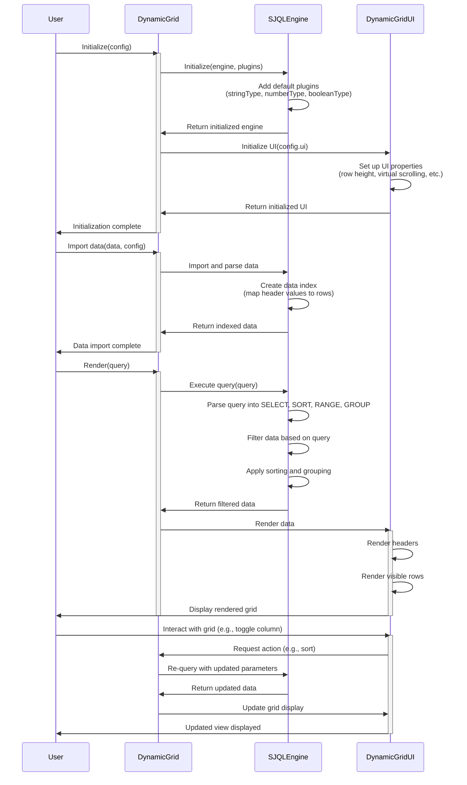
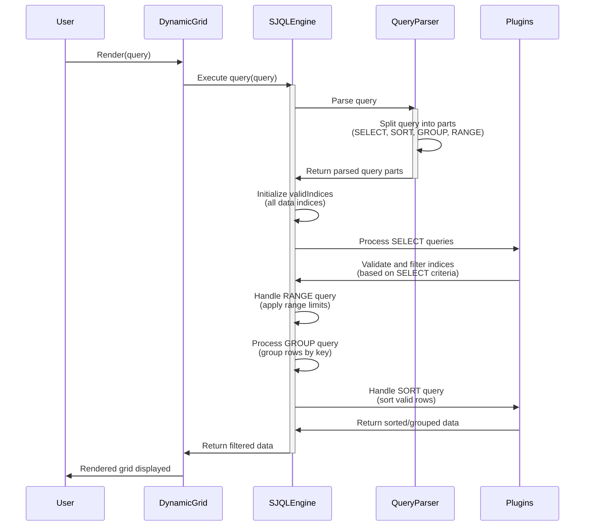

P.S. THIS IS NOT A FINISHED PROJECT, IT IS A WORK IN PROGRESS!!!!
So this 'docs' page is not up to date with the actual project. not all notes are relevant to the current state of the project etc.

to compile the files into a single file, use the following command:

```cmd
/DynamicGrid> npx terser ./DynamicGrid/DynamicGrid.js ./DynamicGrid/TypePlugin.js ./DynamicGrid/InherentTypePlugin.js ./DynamicGrid/QueryParser.js ./DynamicGrid/SJQLEngine.js --compress keep_classnames=true,keep_fnames=true,dead_code=true,drop_console=false,drop_debugger=true,keep_fargs=true,keep_fnames=true,keep_infinity=false,passes=1 --output ./dist/DynamicGrid.js
```

make sure that the order is correct, since the files are dependent on each other. you can not compile `InherentTypePlugin.js` before `TypePlugin.js` etc.

or load the `Build.run.xml` inside webstorm and run the `Build` task.


---
How do SJQL queries work.

Write any query in the following format:
`name == 'John' and age > 20`
you can add sort and limit to the query as well: `name == 'John' and age > 20 and sort age desc and limit 10`
this will return the first 10 records that match the query and sort them by age in descending order.

to make sure that the query engine is perfoomrant, i made sure that only one sort and limit query will be parsed into the final query object. So adding multiple sort queries are useless and only the first will be actually used.

### notes
* the query parser system removes (for the parsing part, so values can still contain them) all double spaces from the query string, so make sure that the query is formatted correctly.
* The processing of the data in respect to the query is done using this flowchart:
<br>
<br>



the sequence diagram of the engine is as follows:


* the query parser is partially case insensitive, so `name == 'John'` is the same as `Name == 'John'`
* Make sure that the query is formatted correctly, since the query parser is not (always) able to handle incorrect queries.
* Make sure that the most specific queries are at the beginning of the query, the next query will be executed on the result of the previous query. So `name == 'John' and age > 20` is faster than `age > 20 and name == 'John'` since there are less John's than people over 20.
* Get the fastest result by setting `engine.UseDataEnumeration` to false and `engine.UseDataIndexing` to true. This will use a different method to search the data, but will be faster (1000 rows: 11.5 queries per second vs 8.2 per second).